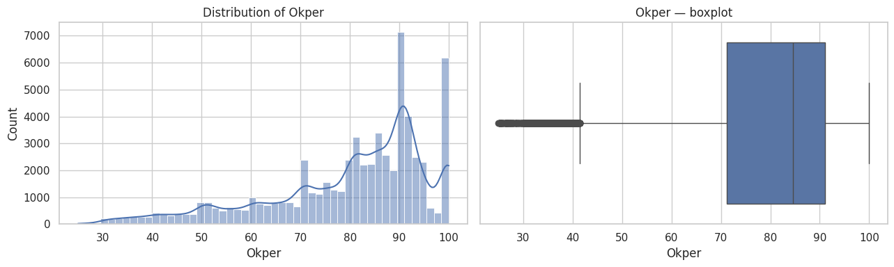
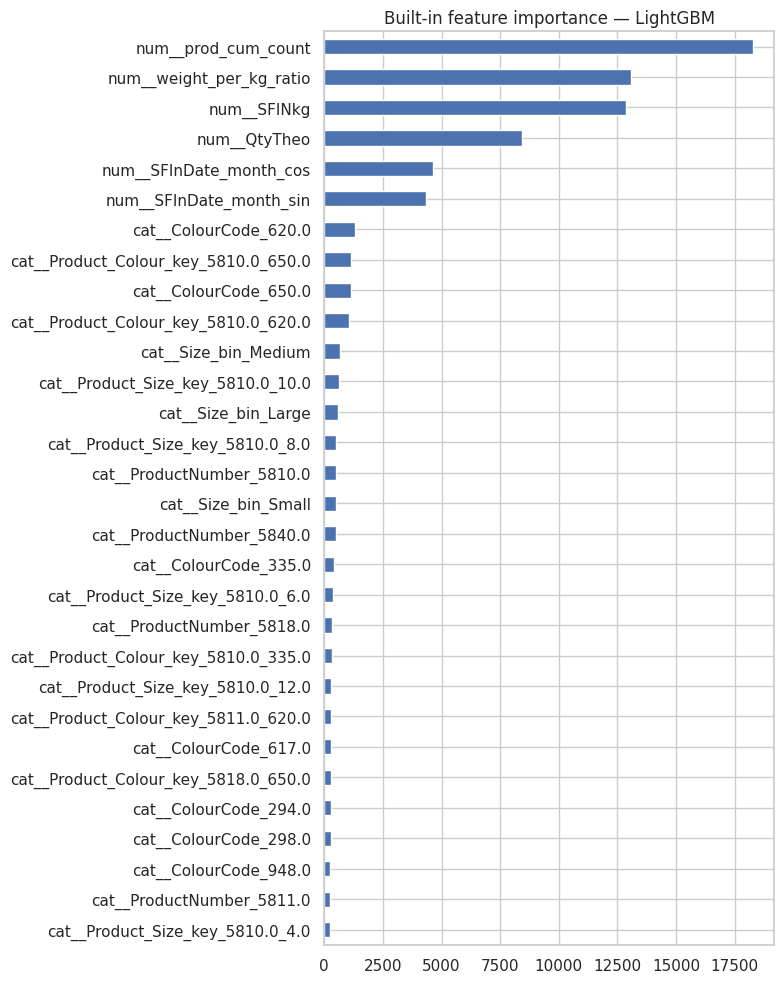
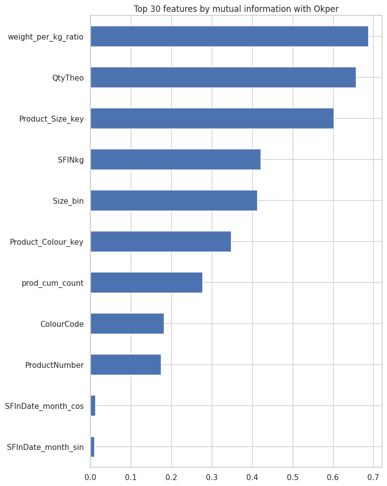
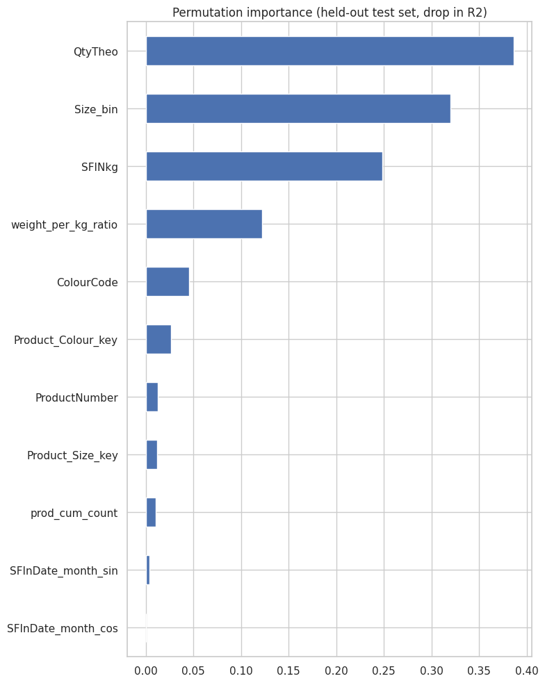
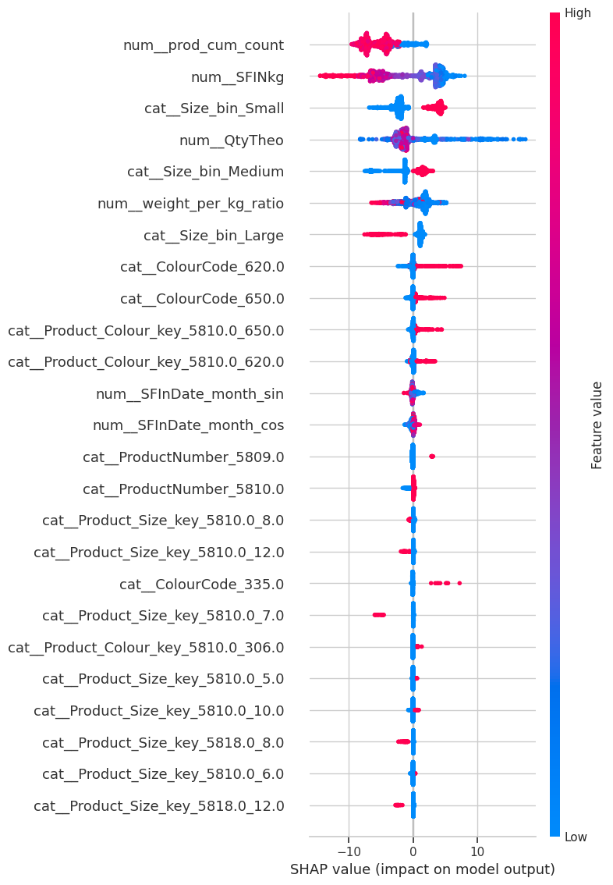
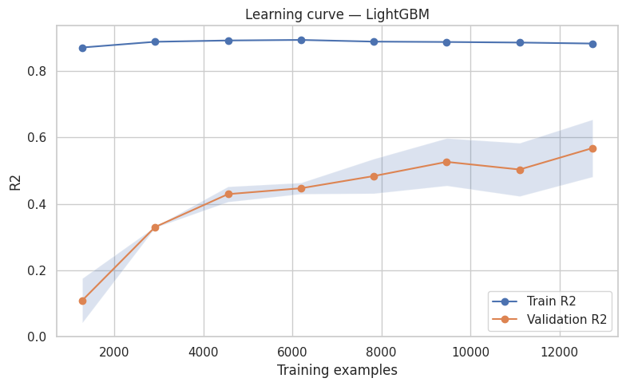

# Project Report

## Swarovski Pearl Yield Prediction Using Machine Learning

---

## Executive Summary

This project develops an end-to-end machine learning pipeline for predicting manufacturing yield (**Okper**) in Swarovski pearl production. The primary objective is to estimate the percentage of acceptable pearls produced in a manufacturing batch using production characteristics, product information, colour attributes, size, and process-related variables.

The workflow includes data preprocessing, exploratory data analysis (EDA), feature engineering, feature selection, model development, hyperparameter optimization, model interpretation, and deployment artifact generation.

Among the evaluated models, **LightGBM** achieved the best performance on the held-out test set with an **R² score of 0.6601**, demonstrating good predictive capability for this manufacturing regression problem. :contentReference[oaicite:0]{index=0}

---

# 1. Business Problem

Manufacturing yield directly affects production cost, material utilization, and operational efficiency.

Being able to predict yield before production completion enables:

- Better production planning
- Early identification of poor-performing batches
- Improved quality control
- Reduced manufacturing waste
- Data-driven process optimization

The objective is to build a regression model capable of predicting **Okper (Yield Percentage)** from historical manufacturing data.

---

# 2. Dataset

The dataset consists of historical manufacturing batches collected from Swarovski production.

The data contains:

- Product identifiers
- Colour codes
- Product sizes
- Manufacturing quantities
- Production dates
- Batch information
- Manufacturing process variables
- Yield percentage (Okper)

The dataset is proprietary and therefore cannot be shared publicly.

---

# 3. Exploratory Data Analysis

Exploratory analysis was performed to understand production characteristics and identify important relationships between manufacturing variables and yield.

The analysis included:

- Yield distribution
- Product-wise yield analysis
- Colour-wise yield analysis
- Size-wise yield analysis
- Monthly and yearly production trends
- Outlier inspection

### Key observations

- Most production batches achieve relatively high yield (70–95%).
- Lower-yield batches appear as manufacturing outliers rather than the dominant trend.
- Product type, colour, and size all influence manufacturing yield.
- Production yield remains relatively consistent over time, indicating a stable manufacturing process.

---

# 4. Feature Engineering

Several domain-driven features were created to improve predictive performance.

These include:

- Product-Colour combinations
- Product-Size combinations
- Quantity-derived features
- Weight-per-kilogram ratio
- Cumulative production statistics
- Cyclic month encoding using sine/cosine transformations

Feature engineering was performed carefully to avoid target leakage.

---

# 5. Model Development

Multiple regression algorithms were evaluated.

Models included:

- Linear Regression
- Ridge Regression
- Lasso Regression
- Random Forest
- K-Nearest Neighbors
- XGBoost
- LightGBM
- Stacking Ensemble

Hyperparameter optimization was performed using **Optuna**.

The best LightGBM configuration included approximately:

- 699 estimators
- 127 leaves
- Learning rate ≈ 0.0145
- Subsample ≈ 0.55
- Column sample ≈ 0.67

These parameters were selected automatically through Bayesian optimization. :contentReference[oaicite:1]{index=1}

---

# 6. Model Performance

The final selected model was **LightGBM**.

| Metric | Value |
|---------|------:|
| R² | **0.6601** |
| MAE | **7.9452** |
| RMSE | **10.5418** |
| MAPE | **12.72%** |

The model explains approximately **66% of the variation** in manufacturing yield while maintaining relatively low prediction error on unseen production batches. :contentReference[oaicite:2]{index=2}

---

# 7. Feature Importance

Three complementary approaches were used to understand model behavior:

- Mutual Information
- Built-in LightGBM Feature Importance
- Permutation Importance

All three approaches consistently identified similar variables as the most influential.

Important features include:

- Quantity (QtyTheo)
- Weight per kilogram ratio
- Product size
- SFINkg
- Size category
- Product-Colour combinations
- Colour code

These variables capture much of the manufacturing variability affecting production yield.

<table>
  <tr>
    <td align="center">
       
      <b>Built-in LightGBM Feature Importance</b>
    </td>
    <td align="center">
       
      <b>Mutual Information</b>
    </td>
    <td align="center">
       
      <b>Permutation Importance</b>
    </td>
  </tr>
</table>

---

# 8. SHAP Analysis

SHAP was used to interpret individual model predictions.

The SHAP analysis showed that:

- Production quantity has the strongest influence on predicted yield.
- Product size significantly impacts manufacturing performance.
- Weight-to-quantity ratio contributes consistently across batches.
- Colour and Product-Colour interactions influence yield for specific product families.
- Time-based features contribute relatively little compared to manufacturing variables.

Using SHAP improves model transparency and provides actionable insights into production behavior.

---

# 9. Learning Curve Analysis

Learning curve analysis was used to evaluate model generalization.

Observations:

- Training performance remains consistently high.
- Validation performance improves steadily with additional training data.
- The gap between training and validation performance indicates moderate overfitting.
- Additional production data is expected to improve model performance further.

---

# 10. Conclusions

This project demonstrates that machine learning can successfully predict manufacturing yield using historical production data.

Major achievements include:

- Complete end-to-end ML workflow
- Leakage-aware feature engineering
- Time-aware validation strategy
- Automated hyperparameter optimization
- Explainable AI using SHAP
- Production-ready preprocessing pipeline

The resulting model provides meaningful predictive performance and can serve as a decision-support tool for manufacturing process optimization.

---

# 11. Future Improvements

Potential future enhancements include:

- Incorporating additional process sensor data
- Time-series forecasting of manufacturing yield
- Automated model retraining
- Model drift monitoring
- Real-time deployment through a REST API
- Interactive manufacturing dashboard for production monitoring

---

# Repository

For implementation details, preprocessing pipeline, notebooks, and source code, please refer to the project repository.